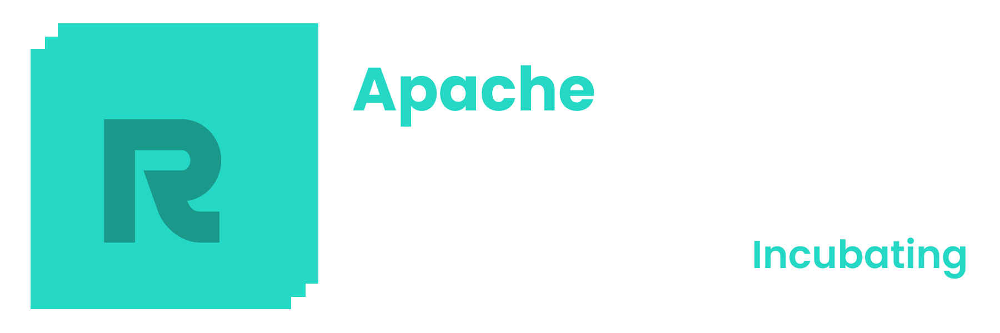

# 

Welcome to the **ResilientDB Quickstart Guide**—your one-stop shop for all ResilientDB projects and how to get started with them. This documentation provides comprehensive guides to install, use, and contribute to the ResilientDB ecosystem.

---

## 🚀 **What is ResilientDB?**

ResilientDB is a high-performance, scalable, and secure blockchain platform designed to meet the demands of modern distributed applications. It offers a suite of tools and projects that enable developers and organizations to build robust blockchain solutions efficiently.

---

## 📖 **Get Started**

- **[Installation Guide](installation/index.md):** Learn how to install all ResilientDB projects using the `INSTALL.sh` script.
- **[Usage Guides](usage/index.md):** Explore detailed guides on how to use each ResilientDB project.
- **[API Reference](api.md):** Discover the API endpoints provided by the Smart-Contracts GraphQL server.
- **[About Us](about/index.md):** Learn more about the ResilientDB project and the team behind it.

---

## 🛠 **ResilientDB Projects**

- **ResilientDB Core:** The core blockchain platform providing high throughput and scalability.
- **PythonSDK:** A Python SDK for interacting with ResilientDB.
- **ResDBORM:** An Object-Relational Mapping tool for ResilientDB databases.
- **Smart-Contracts CLI:** A command-line interface for managing smart contracts.
- **Smart-Contracts GraphQL:** A GraphQL server for interacting with smart contracts.
- **ResVault:** A secure vault for managing keys and sensitive data.

---

## 💡 **Why Choose ResilientDB?**

- **High Performance:** Achieve high transaction throughput with low latency.
- **Scalability:** Designed to scale horizontally to meet growing demands.
- **Security:** Built with robust security features to protect your data.
- **Flexibility:** Modular architecture allows customization to fit your needs.

---

## 📞 **Get Involved**

- **GitHub:** [ResilientEcosystem](https://github.com/ResilientEcosystem)
- **Contribute:** Check out our [contribution guidelines](CONTRIBUTING.md) to get started.
- **Support:** If you have any questions or need help, feel free to [open an issue](https://github.com/ResilientEcosystem/resilientdb-quickstart/issues).

